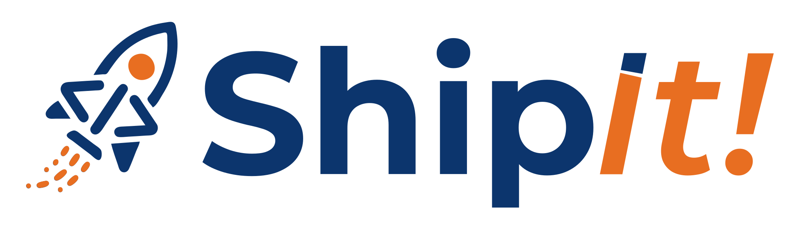

  

<h1 align="center">ShipIt!</h1>

  Automatize a criação do Relatório Mensal de Atividades Desenvolvidas seguindo o padrão institucional do MEC.

  
  
  
  
  
  
  

---

## Sobre

O **ShipIt!** é uma aplicação desktop multiplataforma para profissionais de TI que precisam documentar suas atividades mensais e gerar relatórios no padrão institucional do MEC (Ministério da Educação). O app fica no **System Tray** para fácil acesso — basta clicar, registrar a atividade com evidências (prints, links), e deixar o resto com o ShipIt!.

### Principais funcionalidades

- **Registro rápido de atividades** — descrição, período, status, links de referência e tipo de atendimento
- **Evidências com prints** — upload, arrastar e soltar ou colar da área de transferência (clipboard)
- **Salvamento automático** — rascunhos são salvos continuamente, sem risco de perda de dados
- **Dashboard mensal** — resumo visual com cards de status, gráfico de Gantt e listagem completa
- **Geração de relatório DOCX** — documento formatado seguindo o modelo oficial do MEC, com encarte de atividades e páginas de evidências
- **System Tray** — acesso rápido sem sair do fluxo de trabalho; ícone reflete o status das atividades
- **Dark mode / Light mode** — tema personalizável persistido nas configurações
- **100% offline** — funciona sem conexão com a internet

## Screenshots

> _Em breve._

---

## Download

Baixe o instalador para sua plataforma na página de [Releases](https://github.com/NeuronioAzul/shipit/releases):

| Plataforma | Formato |
|------------|---------|
| Windows    | `.exe` (NSIS) |
| macOS      | `.dmg` |
| Linux      | `.AppImage` |

---

## Documentação

| Documento | Descrição |
|-----------|-----------|
| [docs/DEVELOPMENT.md](docs/DEVELOPMENT.md) | Setup de desenvolvimento, comandos, stack e estrutura do projeto |
| [docs/ARCHITECTURE.md](docs/ARCHITECTURE.md) | Arquitetura detalhada, fluxo IPC, decisões técnicas |
| [docs/DEPENDENCIES.md](docs/DEPENDENCIES.md) | Auditoria de dependências com versões e justificativas |
| [docs/TODO.md](docs/TODO.md) | Roadmap de desenvolvimento com status de cada fase |
| [CHANGELOG.md](CHANGELOG.md) | Histórico de versões e alterações |
| [CONTRIBUTING.md](CONTRIBUTING.md) | Guia para contribuir com o projeto |

---

## Licença

Este projeto está licenciado sob a [Licença ISC](LICENSE).

---

  Feito com ☕ por <a href="https://github.com/NeuronioAzul">NeuronioAzul</a>

