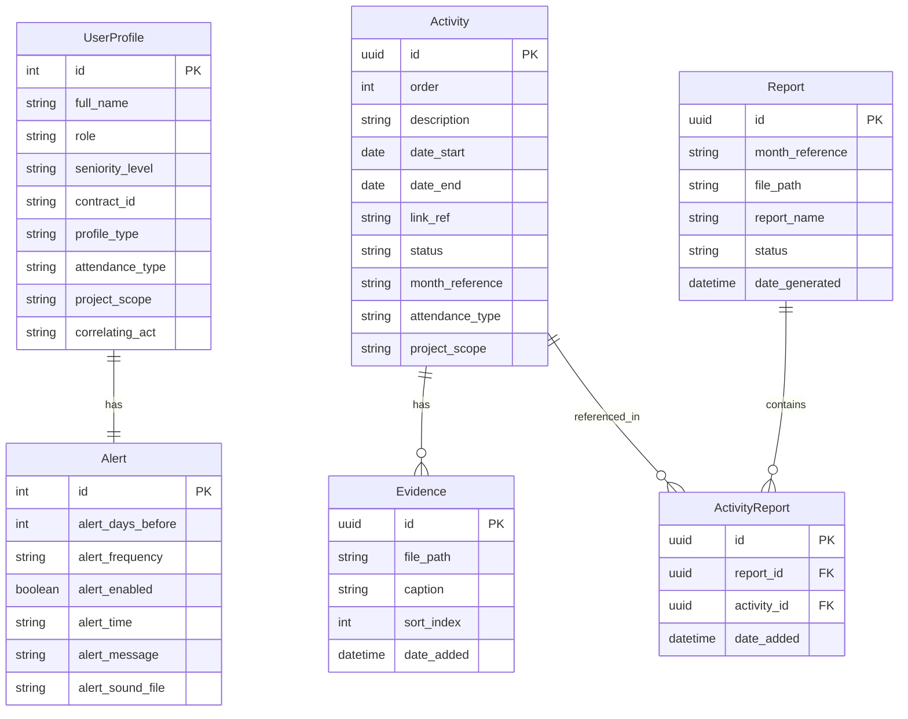

<p align="center">
  
</p>

<h1 align="center">ShipIt!</h1>

<p align="center">
  Automatize a criação do Relatório Mensal de Atividades Desenvolvidas seguindo o padrão institucional do MEC.
</p>

<p align="center">
  
  
  
  
  
  
  
</p>

---

## Sobre

O **ShipIt!** é uma aplicação desktop multiplataforma para profissionais de TI que precisam documentar suas atividades mensais e gerar relatórios no padrão institucional do MEC (Ministério da Educação). O app fica no **System Tray** para fácil acesso — basta clicar, registrar a atividade com evidências (prints, links), e deixar o resto com o ShipIt!.

### Principais funcionalidades

- **Registro rápido de atividades** — descrição, período, status, links de referência e tipo de atendimento
- **Evidências com prints** — upload, arrastar e soltar ou colar da área de transferência (clipboard)
- **Salvamento automático** — rascunhos são salvos continuamente, sem risco de perda de dados
- **Dashboard mensal** — resumo visual com cards de status, gráfico de Gantt e listagem completa
- **Geração de relatório DOCX** — documento formatado seguindo o modelo oficial do MEC, com encarte de atividades e páginas de evidências
- **System Tray** — acesso rápido sem sair do fluxo de trabalho; ícone reflete o status das atividades
- **Dark mode / Light mode** — tema personalizável persistido nas configurações
- **100% offline** — funciona sem conexão com a internet

## Screenshots

> _Em breve._

---

## Requisitos

| Requisito | Versão |
|-----------|--------|
| Node.js   | ≥ 24.0 |
| npm       | ≥ 11.0 |

---

## Instalação e Desenvolvimento

```bash
# Clone o repositório
git clone https://github.com/NeuronioAzul/shipit.git
cd shipit

# Instale as dependências
npm install

# Inicie em modo de desenvolvimento
npm run dev
```

O Vite dev server inicia na porta `5173` e o Electron abre automaticamente.

### Comandos disponíveis

| Comando            | Descrição |
|--------------------|-----------|
| `npm run dev`      | Vite dev server + Electron em paralelo |
| `npm run build`    | Compila TypeScript + Vite build + Electron build |
| `npm run preview`  | Preview do build do Vite |
| `npm run dist`     | Build completo + empacotamento com electron-builder |

---

## Empacotamento (Distribuição)

```bash
# Gerar instalador para a plataforma atual
npm run dist
```

Os artefatos são gerados na pasta `release/`:

| Plataforma | Formato   | Configuração |
|------------|-----------|-------------|
| Windows    | `.exe` (NSIS) | x64 |
| macOS      | `.dmg`   | Universal |
| Linux      | `.AppImage` | x64 |

---

## Stack Tecnológica

| Camada     | Tecnologia                  | Função |
|------------|----------------------------|--------|
| Desktop    | Electron 41 (CommonJS)     | Janela principal, System Tray, IPC, protocolos customizados |
| UI         | React 19 + React Router 7  | SPA com rotas para Dashboard, Atividades, Perfil, Configurações |
| Estilização| Tailwind CSS 4             | `@theme inline` com variáveis CSS, dark/light mode |
| ORM        | TypeORM 0.3 + better-sqlite3 | SQLite local em `userData/shipit.db` |
| Relatórios | jszip + @xmldom/xmldom + xpath | Geração de DOCX via manipulação OpenXML de template |
| Build      | Vite 8                     | Bundler do frontend com HMR |
| Linguagem  | TypeScript 6               | Tipagem estrita em todo o projeto |
| Ícones     | Font Awesome 7             | Self-hosted via npm, sem CDN |

---

## Estrutura do Projeto

```
shipit/
├── electron/                  # Processo principal (Electron, CommonJS)
│   ├── main.ts                # App lifecycle, IPC handlers, System Tray
│   ├── database.ts            # DataSource, CRUD, queries
│   ├── preload.ts             # Context bridge (contextIsolation)
│   ├── report-generator.ts    # Motor de geração DOCX
│   └── entities/              # Entidades TypeORM
│       ├── UserProfile.ts
│       ├── Activity.ts
│       ├── Evidence.ts
│       ├── Alert.ts
│       ├── Report.ts
│       └── ActivityReport.ts
├── src/                       # Renderer (React, ESNext)
│   ├── App.tsx                # Router e layout
│   ├── main.tsx               # Entry point React
│   ├── index.css              # Tailwind v4 @theme inline
│   ├── vite-env.d.ts          # Tipagens globais e interfaces IPC
│   ├── components/            # Componentes reutilizáveis
│   │   ├── AppLayout.tsx
│   │   ├── Header.tsx
│   │   ├── EmptyState.tsx
│   │   └── EvidenceUpload.tsx
│   ├── pages/                 # Páginas/rotas
│   │   ├── HomePage.tsx       # Router → Dashboard ou EmptyState
│   │   ├── DashboardPage.tsx  # Resumo mensal + Gantt
│   │   ├── ActivitiesPage.tsx # Listagem de atividades
│   │   ├── ActivityFormPage.tsx    # Formulário criar/editar
│   │   ├── ActivityDetailPage.tsx  # Detalhes da atividade
│   │   ├── ProfilePage.tsx    # Perfil do usuário
│   │   └── SettingsPage.tsx   # Configurações do app
│   ├── contexts/
│   │   └── ThemeContext.tsx    # Dark/Light mode
│   ├── services/
│   │   └── localDb.ts         # Fallback localStorage (browser dev)
│   └── utils/
│       └── validation.ts      # Validação de campos obrigatórios
├── images/                    # Logos, ícones, tray icons
├── sfx/                       # Sons de alerta (14 MP3s)
├── docs/                      # Documentação e templates
│   ├── ARCHITECTURE.md
│   ├── DEPENDENCIES.md
│   ├── TODO.md
│   └── Relatórios 2026/       # Template DOCX oficial
├── package.json
├── vite.config.ts
├── tsconfig.json              # Config TS do renderer
└── tsconfig.electron.json     # Config TS do main process
```

---

## Modelo de Dados



---

## Segurança

- `contextIsolation: true` e `nodeIntegration: false` — o renderer não tem acesso direto ao Node.js
- Comunicação via `contextBridge` com IPC handlers prefixados (`db:`, `app:`)
- Protocolos customizados (`shipit-evidence://`, `shipit-sfx://`) com validação de path e sandbox por diretório
- Evidências copiadas para diretório interno do app, isoladas do filesystem do usuário

---

## Documentação

| Documento | Descrição |
|-----------|-----------|
| [docs/ARCHITECTURE.md](docs/ARCHITECTURE.md) | Arquitetura detalhada, fluxo IPC, decisões técnicas |
| [docs/DEPENDENCIES.md](docs/DEPENDENCIES.md) | Auditoria de dependências com versões e justificativas |
| [docs/TODO.md](docs/TODO.md) | Roadmap de desenvolvimento com status de cada fase |
| [CHANGELOG.md](CHANGELOG.md) | Histórico de versões e alterações |
| [CONTRIBUTING.md](CONTRIBUTING.md) | Guia para contribuir com o projeto |

---

## Licença

Este projeto está licenciado sob a [Licença ISC](LICENSE).

---

<p align="center">
  Feito com ☕ por <a href="https://github.com/NeuronioAzul">NeuronioAzul</a>
</p>
