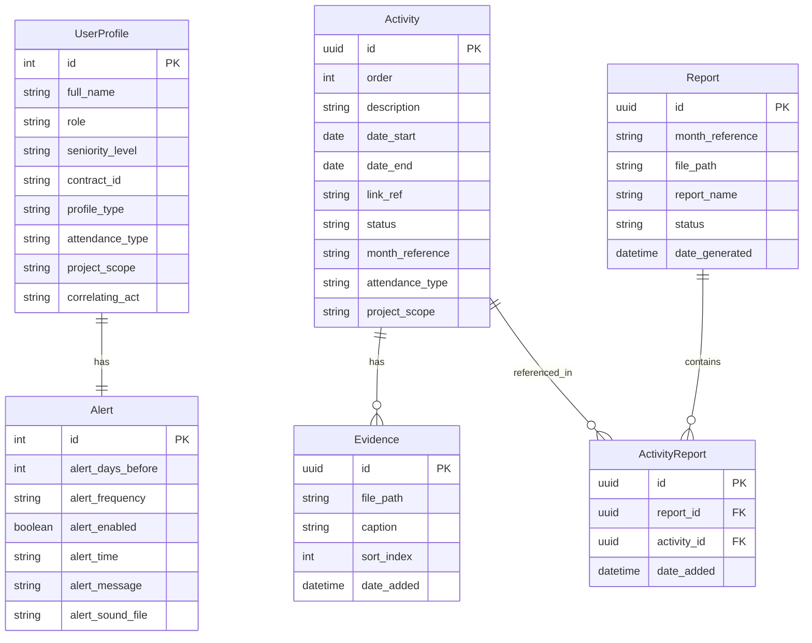

# ShipIt! — Guia de Desenvolvimento

> Informações técnicas para quem deseja compilar, contribuir ou entender a arquitetura do projeto.

---

## Requisitos

| Requisito | Versão |
|-----------|--------|
| Node.js   | ≥ 24.0 |
| npm       | ≥ 11.0 |

---

## Instalação e Desenvolvimento

```bash
# Clone o repositório
git clone https://github.com/NeuronioAzul/shipit.git
cd shipit

# Instale as dependências
npm install

# Inicie em modo de desenvolvimento
npm run dev
```

O Vite dev server inicia na porta `5173` e o Electron abre automaticamente.

### Comandos disponíveis

| Comando            | Descrição                                            |
| ------------------ | ---------------------------------------------------- |
| `npm run dev`      | Vite dev server + Electron em paralelo               |
| `npm run build`    | Compila TypeScript + Vite build + Electron build     |
| `npm run preview`  | Preview do build do Vite                             |
| `npm run dist`     | Build completo + empacotamento com electron-builder  |
| `npm test`         | Executa 55 testes unitários e de integração (Vitest) |
| `npm run test:e2e` | Testes end-to-end com Playwright                     |

---

## Empacotamento (Distribuição)

```bash
# Gerar instalador para a plataforma atual
npm run dist
```

Os artefatos são gerados na pasta `release/`:

| Plataforma | Formato              | Configuração |
| ---------- | -------------------- | ------------ |
| Windows    | `.exe` (NSIS Setup)  | x64          |
| Windows    | `.exe` (Portable)    | x64          |
| Windows    | `.msi`               | x64          |
| macOS      | `.dmg`               | arm64, x64   |
| Linux      | `.AppImage`          | x64          |
| Linux      | `.deb`               | amd64        |
| Linux      | `.rpm`               | x86_64       |

### CI/CD

O workflow `.github/workflows/release.yml` é acionado por tags semver (`v*.*.*`):

1. **create-release**: cria GitHub Release como **draft** (revisão manual antes de publicar)
2. **build-windows**: compila e publica `.exe` (Setup + Portable) e `.msi`
3. **build-macos**: compila DMGs para arm64 e x64
4. **build-linux**: compila AppImage, `.deb` e `.rpm`

### Ícones

O app usa dois arquivos `.ico` com papéis distintos:

| Arquivo | Uso | Incluído no asar? |
|---------|-----|-------------------|
| `build/icon.ico` | Embutido no `.exe` pelo electron-builder (File Explorer, instalador, Add/Remove Programs) | Não |
| `public/assets/images/icons/ShipIt.ico` | `BrowserWindow.icon` em runtime (taskbar quando app aberto) | Sim |

Ambos são idênticos (9 tamanhos: 16–256px, 32bpp RGBA). O diretório `build/` é o `buildResources` do electron-builder e **não** é empacotado no asar — por isso o ícone de runtime deve apontar para `public/`.

Outros ícones:

| Arquivo | Uso |
|---------|-----|
| `public/assets/images/tray/tray-icon-foguete-*.png` | Ícones do System Tray (black/green/yellow/red) |
| `public/assets/images/icons/favicon-96x96.png` | Notificações nativas do Electron |
| `public/assets/images/icons/apple-icon.icns` | Ícone macOS (electron-builder) |

> **Importante**: `signAndEditExecutable` deve ser `true` (padrão) no `package.json` — se `false`, o electron-builder não substitui o ícone do Electron no `.exe`.

---

## Stack Tecnológica

| Camada      | Tecnologia                     | Função                                                          |
| ----------- | ------------------------------ |---------------------------------------------------------------- |
| Desktop     | Electron 41 (CommonJS)         | Janela principal, System Tray, IPC, protocolos customizados     |
| UI          | React 19 + React Router 7      | SPA com rotas para Dashboard, Atividades, Perfil, Configurações |
| Estilização | Tailwind CSS 4                 | `@theme inline` com variáveis CSS, dark/light mode              |
| ORM         | TypeORM 0.3 + better-sqlite 3  | SQLite local em `userData/shipit.db`                            |
| Relatórios  | jszip + @xmldom/xmldom + xpath | Geração de DOCX via manipulação OpenXML de template             |
| Build       | Vite 8                         | Bundler do frontend com HMR                                     |
| Linguagem   | TypeScript 6                   | Tipagem estrita em todo o projeto                               |
| Ícones      | Font Awesome 7                 | Self-hosted via npm, sem CDN                                    |

---

## Estrutura do Projeto

```text
shipit/
├── .github/
│   ├── copilot-instructions.md
│   └── workflows/
│       └── release.yml        # CI/CD: build & release multiplataforma
├── electron/                  # Processo principal (Electron, CommonJS)
│   ├── main.ts                # App lifecycle, IPC handlers, System Tray
│   ├── database.ts            # DataSource, CRUD, queries
│   ├── preload.ts             # Context bridge (contextIsolation)
│   ├── report-generator.ts    # Motor de geração DOCX
│   └── entities/              # Entidades TypeORM
│       ├── UserProfile.ts
│       ├── Activity.ts
│       ├── Evidence.ts
│       ├── Alert.ts
│       ├── Report.ts
│       └── ActivityReport.ts
├── src/                       # Renderer (React, ESNext)
│   ├── App.tsx                # Router e layout
│   ├── main.tsx               # Entry point React
│   ├── index.css              # Tailwind v4 @theme inline
│   ├── vite-env.d.ts          # Tipagens globais e interfaces IPC
│   ├── components/            # Componentes reutilizáveis
│   │   ├── AppLayout.tsx
│   │   ├── Header.tsx
│   │   ├── EmptyState.tsx
│   │   └── EvidenceUpload.tsx
│   ├── pages/                 # Páginas/rotas
│   │   ├── HomePage.tsx       # Router → Dashboard ou EmptyState
│   │   ├── DashboardPage.tsx  # Resumo mensal + Gantt
│   │   ├── ActivitiesPage.tsx # Listagem de atividades
│   │   ├── ActivityFormPage.tsx    # Formulário criar/editar
│   │   ├── ActivityDetailPage.tsx  # Detalhes da atividade
│   │   ├── ProfilePage.tsx    # Perfil do usuário
│   │   └── SettingsPage.tsx   # Configurações do app
│   ├── contexts/
│   │   └── ThemeContext.tsx    # Dark/Light mode
│   ├── services/
│   │   └── localDb.ts         # Fallback localStorage (browser dev)
│   └── utils/
│       └── validation.ts      # Validação de campos obrigatórios
├── assets/                    # Recursos estáticos
│   ├── images/                # Logos, ícones, tray icons
│   └── sounds/                # Sons de alerta (14 MP3s)
├── docs/                      # Documentação e templates
│   ├── ARCHITECTURE.md
│   ├── DEPENDENCIES.md
│   ├── TODO.md
│   └── Relatórios 2026/       # Template DOCX oficial
├── package.json
├── vite.config.ts
├── tsconfig.json              # Config TS do renderer
└── tsconfig.electron.json     # Config TS do main process
```

---

## Modelo de Dados



---

## CI/CD — Build & Release Multiplataforma

O projeto usa GitHub Actions para build automatizado e publicação de releases.

### Como funciona

1. Faça suas alterações na branch `dev`
2. Crie um PR de `dev` → `main` e faça merge
3. Crie uma tag semver na `main`: `git tag v1.2.1 && git push origin v1.2.1`
4. O workflow dispara automaticamente e publica no GitHub Releases

### Workflow `.github/workflows/release.yml`

- **Trigger**: push de tag `v*.*.*` (ex: `v1.2.1`, `v1.3.0-beta.1`)
- **3 jobs paralelos**:

| Job | Runner | Artefato | Formato |
| --- | ------ | -------- | ------- |
| `build-windows` | `windows-latest` | `shipit-setup-X.Y.Z.exe` | NSIS installer |
| `build-macos` | `macos-latest` | `shipit-X.Y.Z.dmg` | Disk image |
| `build-linux` | `ubuntu-latest` | `shipit-X.Y.Z-x86_64.AppImage` | Executável portátil |

Cada job executa: `npm ci` → `npm test` (gate) → `npm run build` → `electron-builder --publish always`

### Artefatos gerados no GitHub Release

| Arquivo | Descrição |
| ------- | --------- |
| `shipit-setup-X.Y.Z.exe` | Instalador Windows |
| `shipit-X.Y.Z.dmg` | Instalador macOS |
| `shipit-X.Y.Z-x86_64.AppImage` | Executável Linux |
| `*.blockmap` | Mapas de blocos para delta updates (só os blocos alterados são baixados) |
| `latest.yml` | Manifesto auto-update Windows — contém versão, sha512 e URL do .exe |
| `latest-mac.yml` | Manifesto auto-update macOS |
| `latest-linux.yml` | Manifesto auto-update Linux |

### Auto-Update (`electron-updater`)

Em builds empacotados (`app.isPackaged`), o app verifica atualizações automaticamente ao iniciar:

1. Consulta o `latest*.yml` correspondente à plataforma no GitHub Releases
2. Se houver versão mais recente, baixa automaticamente em background
3. Notifica o usuário via `Notification` nativa ("Atualização disponível" / "Atualização pronta")
4. Instala ao reiniciar o app — **não força restart**

### Pré-requisitos

- Token `GITHUB_TOKEN` (built-in do Actions, sem configuração)
- Permissão `contents: write` no workflow
- Versão no `package.json` deve ser atualizada antes de criar a tag

### Notas

- **Sem code signing**: macOS pede "Abrir mesmo assim" manualmente; Windows pode exibir SmartScreen
- **Minutes do GitHub Actions**: macOS consome 10x mais minutos. Free tier = 2000 min/mês
- **Testes como gate**: se os 55 testes falharem, o build não é publicado

---

## Segurança

- `contextIsolation: true` e `nodeIntegration: false` — o renderer não tem acesso direto ao Node.js
- Comunicação via `contextBridge` com IPC handlers prefixados (`db:`, `app:`)
- Protocolos customizados (`shipit-evidence://`, `shipit-sfx://`) com validação de path e sandbox por diretório
- Evidências copiadas para diretório interno do app, isoladas do filesystem do usuário
